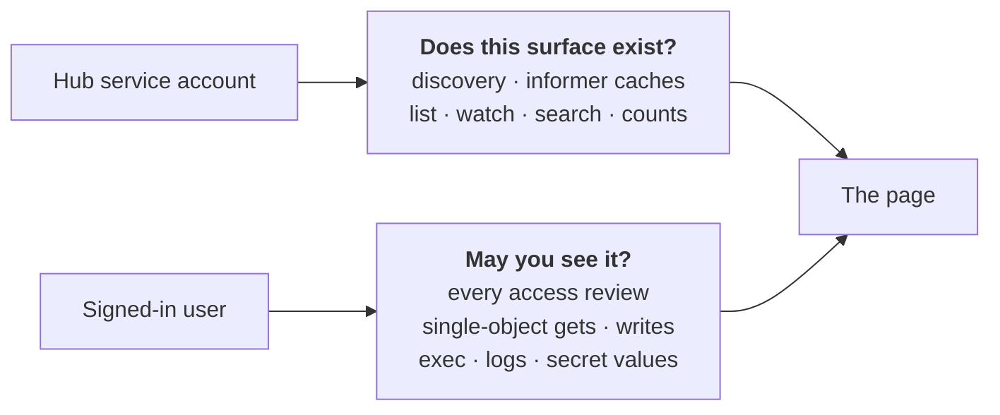

<p align="center">
  
</p>

<p align="center">
  <a href="https://github.com/daiwa-zou/orrery/actions/workflows/ci.yaml"></a>
  <a href="https://github.com/daiwa-zou/orrery/actions/workflows/release.yaml"></a>
  <a href="https://github.com/daiwa-zou/orrery/actions/workflows/ci.yaml"></a>
</p>

One console for every cluster you run. Sign in with your own identity
provider; what you can see and do in each cluster is decided by that cluster's
own RBAC, not by the dashboard.

```
┌──────────────┐    OIDC     ┌───────────────┐   impersonation   ┌────────────┐
│   Browser    │◄───────────►│    Orrery     │──────────────────►│ cluster A  │
│  (SPA, WS)   │  session    │  Go backend   │──────────────────►│ cluster B  │
└──────────────┘  cookie     └───────────────┘   shared caches   │ cluster …  │
                                                                 └────────────┘
```


<details>
<summary>More screenshots — fleet overview and the debugging walk</summary>

The fleet page: every registered cluster, probed live, side by side.


A broken pod's page: containers with state and last exit code, conditions with
reasons, owner references linked upward, logs one click away.


</details>

## What it does

**Every resource, including yours.** One generic API path serves every
group/version/resource the cluster advertises, so custom resources work
exactly like built-in kinds and a CRD installed a minute ago is browsable
immediately — with the same columns `kubectl get` would show.

**Live by default.** Lists stream changes over a WebSocket. A pod flipping to
`CrashLoopBackOff` updates the row you are looking at, without a refresh.

**The things you open a dashboard for.** Log streaming — one container, or a
whole workload's pods merged into a single feed — a terminal into any
container, YAML view and edit, scale, rolling restart, rollout undo, cordon,
drain with dry run, evict, delete, CronJob trigger and suspend, event feeds,
and node/pod metrics from metrics-server. Pod pages resolve each container's
environment — ConfigMap and Secret references, downward-API fields — reading
the referenced objects under your own RBAC.

**Made for the "why is it broken?" walk.** Warning event → object → container
row → that container's logs (`previous` included) → terminal, all without
leaving the page's context. Every object carries a Related panel holding its
whole neighbourhood: the owners above it all the way up, the objects it owns
all the way down, the node it runs on, the services that select it, and the
ConfigMaps and Secrets its spec names — each with the health you came to check
and a link resolved through the cluster's own discovery rather than guessed
from the kind.

**When `exec` cannot reach it.** A crash-looping container has no process to
attach to, and a distroless image has no shell to attach with. Attach an
ephemeral debug container instead, optionally sharing the target's process
namespace — the same thing `kubectl debug` does, gated on the same permission,
with the image chosen by the operator rather than the browser.

**Edits are checked against the cluster first.** Applying YAML sends it with
`dryRun=All` before anything is written, so admission and validating webhooks
run and you see the mutated object — or the rejection — while you can still
change your mind. Field documentation comes from the cluster's own OpenAPI, so
it matches that server's version and covers CRDs that publish a schema.

**Reach the workload, not just its object.** GET and HEAD can be relayed to a
pod or service through the API server's proxy subresource under your own
identity — a health page or an internal dashboard, without a port-forward. It
is read-only, and it can be switched off entirely.

**Multi-cluster that is actually multi-cluster.** Clusters are registered
independently, probed for health, and shown side by side. One unreachable
cluster is marked unreachable and retried in the background; the others keep
working.

**Readable by programs, not just people.** The whole read surface is plain
`GET` — no CSRF token to acquire, no socket to hold open — and
`GET /api/v1/capabilities` describes it: every read route, its parameters,
their types and defaults, for the build that is actually answering. So an
agent, an MCP server or a script gets the questions a human asks, in one call
each: `/search` finds an object by name across every cluster, `.../related`
returns an object's owners, children, node, services, mounted ConfigMaps and
events together, `/logs` reads twenty pods at once without a WebSocket, and
`/access` answers "may I?" before a tool reports that a list is empty when it
is really forbidden. Every one of them runs the same `SubjectAccessReview` the
console does; a scan the caller may not run comes back as a warning rather than
a silent gap.

**One search bar does everything.** Bare words are free text; `app=web`,
`tier!=cache`, `!deprecated` and `key in (a,b)` are label terms; dotted keys
like `status.phase=Running` are field terms. `⌘K` opens it from anywhere, `?`
lists every shortcut. A view worth returning to can be starred and reopened
from the palette, a label you keep squinting at can be promoted to its own
column, and there is a light theme for people who work in daylight.

## How permission works

This is the part worth understanding before you deploy it.

Orrery never decides what you may see. Every read and every write is preceded
by a `SubjectAccessReview` against the cluster in question, so your Roles,
ClusterRoles, webhook authorizers and admission plugins remain the only
authority. Verdicts are cached briefly, so a fifty-row table is not fifty
round trips. Anything you lack permission for is dimmed with a tooltip saying
so — not hidden, and not a surprise 403.

Each cluster picks one of three modes:

| Mode | Who the API server sees | Use it when |
| --- | --- | --- |
| `impersonation` *(default)* | The signed-in user, via `Impersonate-User` / `Impersonate-Group` | Almost always. RBAC applies per user and the audit log names them. |
| `passthrough` | The user, via their own OIDC token as bearer | The cluster's API server already trusts your OIDC issuer. |
| `serviceaccount` | The dashboard | Read-only demo clusters with no per-user identity. |

Under impersonation the dashboard holds one credential per cluster and adds
the user's identity as headers. That buys correct per-user RBAC *and* a single
shared cache — the reason it stays cheap as users are added. The trade is real
and worth stating plainly: **the dashboard's service account can impersonate
anyone**, so the pod must be treated as a sensitive workload.

Two credentials are in play, and they answer different questions:



Narrowing the hub's grants is how you keep a resource family — certificates,
secrets, a whole API group — out of the dashboard's caches entirely;
[docs/RBAC.md](docs/RBAC.md) covers that and the minimum grant for a read-only
install. Claim mapping mirrors the kube-apiserver's own flags, so an
impersonated identity matches your existing bindings exactly — see
[docs/OIDC.md](docs/OIDC.md).

## Quick start

The quickest start is a [release binary](https://github.com/daiwa-zou/orrery/releases):
one self-contained executable per platform with the web UI embedded.

```bash
./orrery -config orrery.yaml
```

`SHA256SUMS` on the release page verifies the download, and `./orrery -version`
reports what you got.

To hack on it instead you need Go 1.26+, Node 22+ and a cluster:

```bash
kind create cluster --name lens-a
kind create cluster --name lens-b
make run        # backend on :8080, against configs/orrery.dev.yaml
make web-dev    # SPA on :5173, proxying /api to the backend
```

`configs/orrery.dev.yaml` has OIDC off and registers both kind contexts from
`${HOME}/.kube/config`, deliberately in different modes so both code paths get
exercised: `lens-a` as `serviceaccount` (the dashboard's own credential, full
access) and `lens-b` as `impersonation`. One cluster is enough to see
something — the other is simply listed as unreachable — so skip `lens-b` if
you only want the fast path.

With OIDC off every request runs as `orrery:anonymous` in group
`system:authenticated`, and the server says so at startup. That identity is
what `lens-b` impersonates, so until you grant it something, `lens-a` shows
everything and `lens-b` shows nothing:

```bash
kubectl --context kind-lens-b create clusterrolebinding orrery-view \
  --clusterrole=view --user='orrery:anonymous'
```

Point it at your own clusters by editing the `clusters:` list. `context: '*'`
turns every context in a kubeconfig into a registered cluster.
`deploy/dev/teardown.sh` removes the whole local setup — both kind clusters
and the supporting containers.

<details>
<summary>Trying the OIDC flow locally</summary>

`configs/orrery.oidc.yaml` is wired to a local [Dex](https://dexidp.io):

```bash
docker run -d --name orrery-dex -p 5556:5556 \
  -v $PWD/deploy/dev/dex.yaml:/etc/dex/config.yaml:ro \
  ghcr.io/dexidp/dex:v2.44.0 dex serve /etc/dex/config.yaml
```

Dex's mock connector signs you in as `kilgore@kilgore.trout` in group
`authors`. Both clusters in that config use impersonation, so grant the
identity something first:

```bash
kubectl create clusterrolebinding demo-view \
  --clusterrole=view --group='oidc:authors'
```

Full walkthrough, per-provider setup and troubleshooting:
[docs/OIDC.md](docs/OIDC.md).

</details>

## Deploying it

```bash
helm install orrery ./deploy/helm/orrery \
  --set publicURL=https://orrery.example.com \
  --set oidc.issuer=https://accounts.example.com \
  --set oidc.clientID=orrery
```

The chart expects two secrets and a Redis you provide. Images are published by
CI to `ghcr.io/daiwa-zou/orrery` (multi-arch, distroless, nonroot) on every
push to `main` and on `v*` tags.

Read [docs/DEPLOYMENT.md](docs/DEPLOYMENT.md) before going to production — it
covers the prerequisites, the topologies that work, what to tune, and
[three failure modes](docs/DEPLOYMENT.md#three-things-that-bite-people) that
each look like an unrelated bug when you hit them.

## Development

`make help` lists every target. The ones worth knowing:

```bash
make run        # server against configs/orrery.dev.yaml
make web-dev    # Vite dev server on :5173
make test       # go test ./... -race
make check      # everything CI gates on, in one command
make bundle     # self-contained binary with the UI embedded
```

Three things that catch people out:

- **`tsc -b`, not `tsc --noEmit`.** `tsconfig.json` uses project references
  with an empty `files` list, so the latter typechecks nothing and passes on
  anything.
- **The Redis session tests skip** unless you point them at an instance:
  `ORRERY_TEST_REDIS_URL=redis://127.0.0.1:6379/1 go test ./internal/auth/ -race`.
- **The dev server proxies `/api` to `127.0.0.1:8080`.** Set `ORRERY_API` to
  point it at a backend on another port when 8080 is already taken.

`./orrery -print-config` prints the fully resolved configuration with secrets
masked, which settles most "is it actually reading my file?" questions.
[web/README.md](web/README.md) covers the frontend's own conventions.

CI runs all of it on every pull request, plus a Helm lint, a container build,
and security scans (`govulncheck`, `npm audit`, Trivy over the image and for
committed secrets, dependency review). The suite re-runs weekly, because CVE
databases move even when the code does not.

## Project layout

One Go module at the repository root, so `go build ./cmd/orrery`,
`go test ./...` and `go install github.com/daiwa-zou/orrery/cmd/orrery@latest`
work without a `cd` first.

```
cmd/orrery/   the server entry point
internal/     api, auth, authz, cluster, config, server, webfs
web/          the Vite + React single-page app
configs/      sample configurations for local runs
deploy/       Helm chart, dev Dex, remote-cluster RBAC
docs/         guides and brand assets
```

Everything importable lives under `internal/`, so there is no public API
surface to keep stable, and `cmd/orrery` is the only binary.

## Documentation

- [ARCHITECTURE.md](docs/ARCHITECTURE.md) — the caching and authorization
  design, including what was deliberately made slower in exchange for being
  correct.
- [API.md](docs/API.md) — the HTTP and WebSocket surface, and the metrics.
- [DEPLOYMENT.md](docs/DEPLOYMENT.md) — production topologies, scaling, tuning
  and security posture.
- [OIDC.md](docs/OIDC.md) — provider setup, claim mapping, troubleshooting.
- [RBAC.md](docs/RBAC.md) — what the service account may do, how to switch a
  resource family such as certificates on or off, and the minimum grant for a
  read-only console.
- [DECISIONS.md](docs/DECISIONS.md) — what was considered and deliberately not
  built, and what would change the answer.
- [RELEASING.md](docs/RELEASING.md) — what a `v*` tag produces, and the one
  thing to bump before cutting one.
- [deploy/remote-cluster](deploy/remote-cluster/) — registering a remote
  cluster: RBAC manifests for both auth modes, and a preflight check.
- [web/README.md](web/README.md) — working in the SPA: layout, conventions,
  and the gotchas specific to the frontend.

## License

[Apache License 2.0](LICENSE) — permissive, with an explicit patent grant.
The same license Kubernetes and its client libraries use, so there is nothing
to reconcile if you vendor this alongside them.
