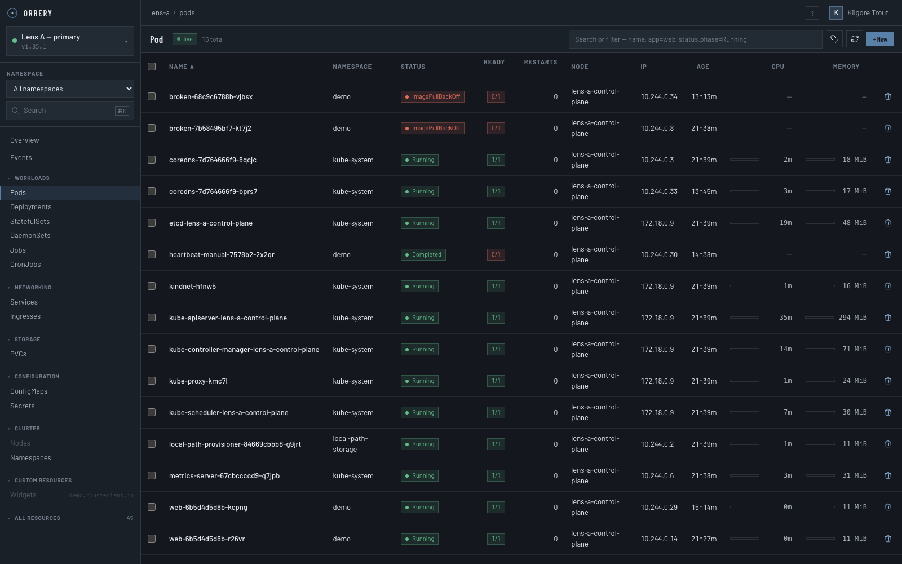
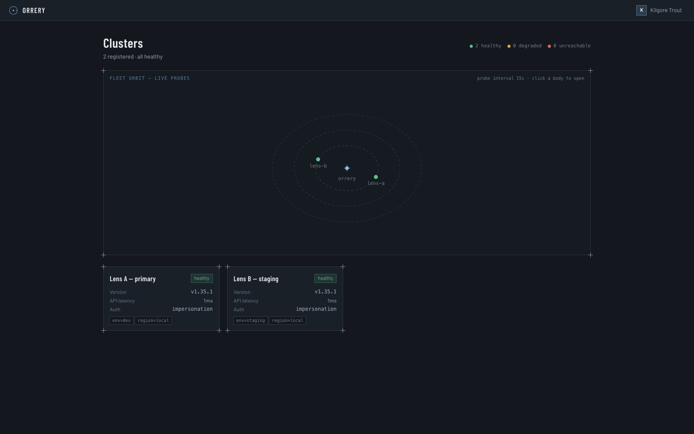
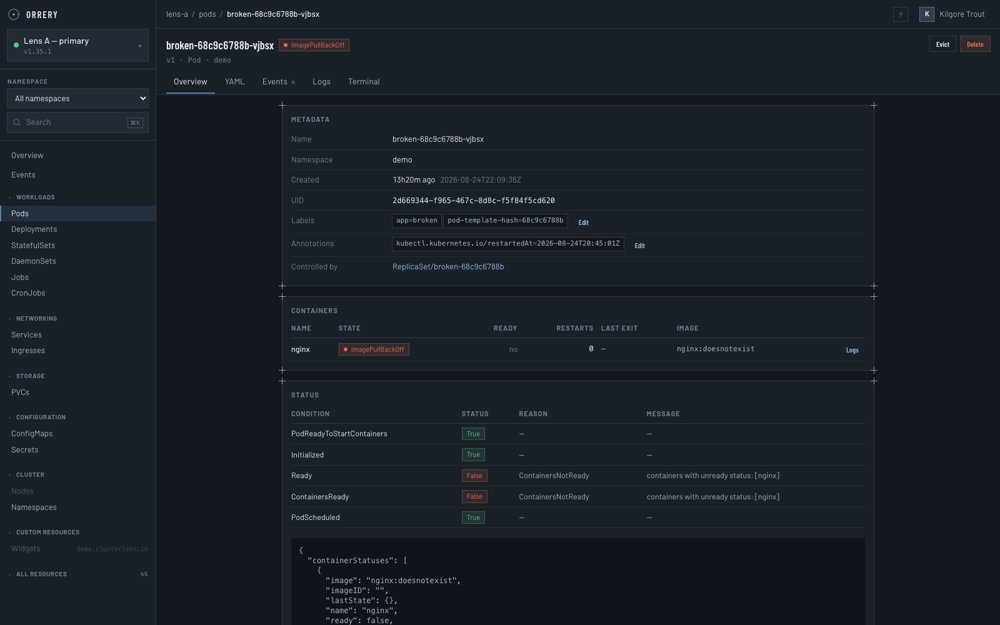

# Orrery

[](https://github.com/daiwa-zou/orrery/actions/workflows/ci.yaml)
[](https://github.com/daiwa-zou/orrery/actions/workflows/release.yaml)
[](https://github.com/daiwa-zou/orrery/actions/workflows/ci.yaml)

A multi-cluster Kubernetes dashboard with OIDC sign-in.

One console for every cluster you run. Sign in with your own identity provider;
what you can see and do in each cluster is decided by that cluster's own RBAC,
not by the dashboard.

```
┌──────────────┐    OIDC     ┌───────────────┐   impersonation   ┌────────────┐
│   Browser    │◄───────────►│    Orrery     │──────────────────►│ cluster A  │
│  (SPA, WS)   │  session    │  Go backend   │──────────────────►│ cluster B  │
└──────────────┘  cookie     └───────────────┘   shared caches   │ cluster …  │
                                                                 └────────────┘
```



<details>
<summary>More screenshots — fleet overview and the debugging walk</summary>

The fleet page: every registered cluster, probed live, side by side.



A broken pod's page: containers with state and last exit code, conditions with
reasons, owner references linked upward, logs one click away.



</details>

## What it does

**Every resource, including yours.** One generic API path serves every
group/version/resource the cluster advertises, so built-in kinds and custom
resources work identically — no per-kind backend code, and a CRD installed a
minute ago is browsable immediately. Well-known kinds get hand-tuned tables;
custom resources get their own `additionalPrinterColumns`, the same columns
`kubectl get` would show.

**Live by default.** Lists stream changes over a WebSocket. A pod flipping to
`CrashLoopBackOff` updates the row you are looking at without a refresh.

**The things you open a dashboard for.** Log streaming with follow and filter,
an interactive terminal into any container, YAML view and edit, scale, rolling
restart, cordon, drain with dry run, evict, delete, a cluster-wide event feed
plus events scoped to an object, and node/pod metrics from metrics-server —
including live CPU/memory columns on the pod list.

**Made for the "why is it broken?" walk.** A pod's page tables its containers
with state, restarts and last exit code, each row one click from that
container's logs. Workloads link to the pods their selector owns; nodes link
to the pods scheduled on them; owner references link upward. The trail from a
warning event to the crashing container's previous logs never leaves the UI.

**Multi-cluster that is actually multi-cluster.** Clusters are registered
independently, probed for health, and shown side by side on the fleet page.
One unreachable cluster does not stop the others from working — it is marked
unreachable and retried in the background.

## How permission works

This is the part worth understanding before you deploy it.

Orrery never decides what you may see. Every read and every write is
preceded by a `SubjectAccessReview` against the cluster in question, so your
Roles, ClusterRoles, webhook authorizers and admission plugins remain the only
authority. Verdicts are cached for 30 seconds so a fifty-row table is not fifty
round trips.

Each cluster picks one of three modes:

| Mode | Who the API server sees | Use it when |
| --- | --- | --- |
| `impersonation` *(default)* | The signed-in user, via `Impersonate-User` / `Impersonate-Group` | Almost always. RBAC applies per user and the audit log names them. |
| `passthrough` | The user, via their own OIDC token as bearer | The cluster's API server already trusts your OIDC issuer. |
| `serviceaccount` | The dashboard | Read-only demo clusters with no per-user identity. |

Under impersonation the dashboard holds one credential per cluster and adds the
user's identity as headers. That gets you correct per-user RBAC *and* a single
shared cache — the reason the dashboard stays cheap as users are added. The
trade is real and worth stating plainly: **the dashboard's service account can
impersonate anyone**, so the pod must be treated as a sensitive workload.

Claim mapping mirrors the kube-apiserver's own flags (`usernameClaim`,
`groupsClaim`, and their prefixes): a configured prefix always applies, `-`
disables prefixing, and when no prefix is set the default is the bare address
for an `email` claim and `issuer#value` for any other claim. Configure both
the same way and an impersonated identity matches your existing bindings
exactly.

## Running it locally

You need Go 1.25+, Node 22+ and a cluster. With `kind`:

```bash
kind create cluster --name lens-a
```

Point the backend at it and start both halves:

```bash
cd backend && go run ./cmd/orrery -config ../orrery.dev.yaml
```

```bash
cd web && npm install && npm run dev
```

The dev config registers `kind-lens-a` in `serviceaccount` mode with OIDC off,
which is the fastest way to see something. The SPA runs on
<http://localhost:5173> and proxies `/api` — REST and WebSocket alike — to the
backend on `:8080`.

To point at every context in your kubeconfig at once, set `context: '*'` and
each context becomes a registered cluster.

### Trying the OIDC flow

`orrery.oidc.yaml` is wired to a local [Dex](https://dexidp.io):

```bash
docker run -d --name orrery-dex -p 5556:5556 \
  -v $PWD/deploy/dev/dex.yaml:/etc/dex/config.yaml:ro \
  ghcr.io/dexidp/dex:v2.44.0 dex serve /etc/dex/config.yaml
```

Dex's mock connector signs you in as `kilgore@kilgore.trout` in group
`authors`. Both clusters in that config use impersonation, so grant the
identity something before expecting to see anything:

```bash
kubectl create clusterrolebinding demo-view \
  --clusterrole=view --group='oidc:authors'
```

A full walkthrough of the flow, claim mapping, per-provider setup (Dex,
Keycloak, Entra ID, Okta, Google) and troubleshooting lives in
[docs/OIDC.md](docs/OIDC.md).

## Using it

- **One search bar does everything.** Bare words are free text against name,
  namespace and labels; `app=web`, `tier!=cache`, `!deprecated`,
  `key in (a,b)` are label terms; dotted keys like `status.phase=Running` are
  field terms. Autocomplete is fed by the facets of what you may actually see.
- **`⌘K` opens search from anywhere; `?` shows every shortcut.**
- **Lists are live** — the `live` badge means rows update over a WebSocket.
  Click a label chip to filter by it; column headers sort server-side.
- **Actions live on the row and the detail page.** Anything you lack
  permission for is dimmed with a tooltip saying so, not hidden and not a
  surprise 403.
- **The debugging walk is linked end to end:** warning event → object →
  container row → that container's logs (`previous` included) → terminal,
  without leaving the page's context.

## Deploying it

Full guide — topologies, scaling behaviour, security posture, upgrades —
in [docs/DEPLOYMENT.md](docs/DEPLOYMENT.md). The short version:

```bash
kubectl create secret generic orrery-session \
  --from-literal=encryptionKey="$(openssl rand -base64 32)"
kubectl create secret generic orrery-oidc \
  --from-literal=clientSecret='...'

helm install orrery ./deploy/helm/orrery \
  --set publicURL=https://orrery.example.com \
  --set oidc.issuer=https://accounts.example.com \
  --set oidc.clientID=orrery
```

Container images are published by CI to
`ghcr.io/daiwa-zou/orrery` (multi-arch, distroless, nonroot) on every push
to `main` and on `v*` tags; the chart's default `session.store: redis`
expects a Redis you provide (see the deployment guide).

Three things bite people here:

- **The session key must be shared across replicas.** Without it each pod mints
  its own at boot and users are signed out whenever they land on a different
  one. The server logs a warning when it generates one.
- **More than one replica needs `session.store: redis`.** The default in-memory
  store keeps sessions inside the pod, so a request that lands elsewhere looks
  unauthenticated. The chart defaults to Redis for exactly this reason; point
  `session.redisURL` at your instance.
- **Long-lived streams need long proxy timeouts.** Log follows, watches and
  exec sessions stay open for hours; the chart sets the nginx annotations, but
  any other proxy in front needs the same treatment.

Remote clusters are added by mounting a kubeconfig secret and listing them:

```yaml
kubeconfigSecret: orrery-kubeconfigs
clusters:
  - name: in-cluster
    inCluster: true
    authMode: impersonation
  - name: prod-eu
    kubeconfig: /etc/orrery/kubeconfigs/prod-eu.yaml
    authMode: impersonation
    labels: { env: production, region: eu-west-1 }
```

## Configuration reference

Every field has a default; `-print-config` shows what the server actually
resolved, with secrets masked. Environment variables
(`ORRERY_OIDC_CLIENT_SECRET`, `ORRERY_SESSION_KEY`, …) override the
file, and `${VAR}` inside the file is expanded — so secrets never have to be
written down next to the rest of the config.

The knobs that matter under load:

| Field | Default | What it controls |
| --- | --- | --- |
| `cache.idleTimeout` | `10m` | How long an unwatched resource cache survives before being stopped. |
| `cache.maxInformersPerCluster` | `64` | Ceiling on concurrent caches per cluster; the least recently used is retired past it. |
| `authz.ttl` | `30s` | How long an access-review verdict is cached. Lower means revocations apply sooner and more load on the API server. |
| `authz.namespaceScanLimit` | `200` | Bound on the per-namespace probe used for users without cluster-wide read. Truncation is reported to the UI, never hidden. |

## API

The whole surface is one shape. `{group}` is `core` for the legacy group and
`{namespace}` is `_` for cluster-scoped resources, so one route serves
everything:

```
GET    /api/v1/clusters
GET    /api/v1/clusters/{c}/discovery
GET    /api/v1/clusters/{c}/overview
GET    /api/v1/clusters/{c}/resources/{group}/{version}/{resource}
GET    /api/v1/clusters/{c}/resources/{group}/{version}/{resource}/{namespace}/{name}
POST   /api/v1/clusters/{c}/resources/{group}/{version}/{resource}
PUT    /api/v1/clusters/{c}/resources/{group}/{version}/{resource}/{namespace}/{name}
PATCH  /api/v1/clusters/{c}/resources/{group}/{version}/{resource}/{namespace}/{name}
DELETE /api/v1/clusters/{c}/resources/{group}/{version}/{resource}/{namespace}/{name}
POST   /api/v1/clusters/{c}/access
POST   /api/v1/clusters/{c}/actions/{scale|restart|cordon|drain|evict}
GET    /api/v1/clusters/{c}/ws/watch/{group}/{version}/{resource}
GET    /api/v1/clusters/{c}/ws/logs
GET    /api/v1/clusters/{c}/ws/exec
GET    /api/v1/clusters/{c}/stats
```

List endpoints take `namespace`, `q`, `labelSelector`, `fieldSelector`, `sort`,
`order`, `page`, `pageSize` and `view=table|full`. `q` is free text matched
against name, namespace and labels (`app=web` works). The watch endpoint
accepts the same `q`/`labelSelector`/`fieldSelector` and translates edits
across the filter boundary into ADDED/DELETED, so a filtered page only hears
about objects it shows. Unsupported `fieldSelector` fields are rejected with
a 400 naming the supported set rather than silently matching nothing.

`GET .../resources/{g}/{v}/{r}/facets` returns the distinct label keys/values
and low-cardinality field values on the objects the caller may list — the
vocabulary behind the search bar's autocomplete. The UI exposes all of this as
one search input: bare words are free text, `key=value` / `key!=value` /
`!key` / `key in (a,b)` are label terms, and dotted keys like
`status.phase=Running` are field terms.

Sessions are cookie-based: the session cookie is `HttpOnly` and encrypted, and
mutating requests carry a double-submit CSRF token in `X-CSRF-Token`.

## Observability

`/metrics` on the metrics listener exposes request rate and latency by route
(labelled by pattern, so cardinality stays bounded), plus live gauges for cache
size and subscriber counts per cluster and resource.

`GET /api/v1/clusters/{c}/stats` shows exactly which caches are running, how
many objects each holds, and how long they have been idle. It is the first
place to look when memory use surprises you.

## Development

```bash
cd backend && go test ./... -race     # backend
cd web && npx tsc -b                  # frontend types
cd web && npm test                    # frontend unit tests
cd web && npm run build               # production bundle
```

`tsc -b`, not `tsc --noEmit`: `tsconfig.json` uses project references with an
empty `files` list, so the latter typechecks nothing and passes on anything.

The Redis session tests skip unless you point them at an instance:

```bash
docker run -d -p 6379:6379 redis:7-alpine
ORRERY_TEST_REDIS_URL=redis://127.0.0.1:6379/1 go test ./internal/auth/ -race
```

CI runs all of the above (with a Redis service for the session-store tests),
lints the Helm chart, and builds the container image on every pull request;
pushes to `main` and `v*` tags publish the image to GHCR — see
[.github/workflows](.github/workflows).

CI also gates on security scans: `govulncheck` over the backend (call-graph
aware, so a failure means a vulnerable code path is actually reachable),
`npm audit` over the web app's production dependencies, a Trivy scan of the
built container image and of the repository for committed secrets, and a
dependency review on pull requests. The whole suite re-runs weekly, because
CVE databases move even when the code does not. The coverage badge above is
the backend's total statement coverage, recomputed on every push to `main`.

Further reading:

- [docs/ARCHITECTURE.md](docs/ARCHITECTURE.md) — the caching and authorization
  design, including the parts deliberately made slower or more conservative in
  exchange for being correct.
- [docs/OIDC.md](docs/OIDC.md) — identity provider setup, claim mapping, and
  troubleshooting.
- [docs/DEPLOYMENT.md](docs/DEPLOYMENT.md) — production topologies, scaling
  behaviour, and security posture.
