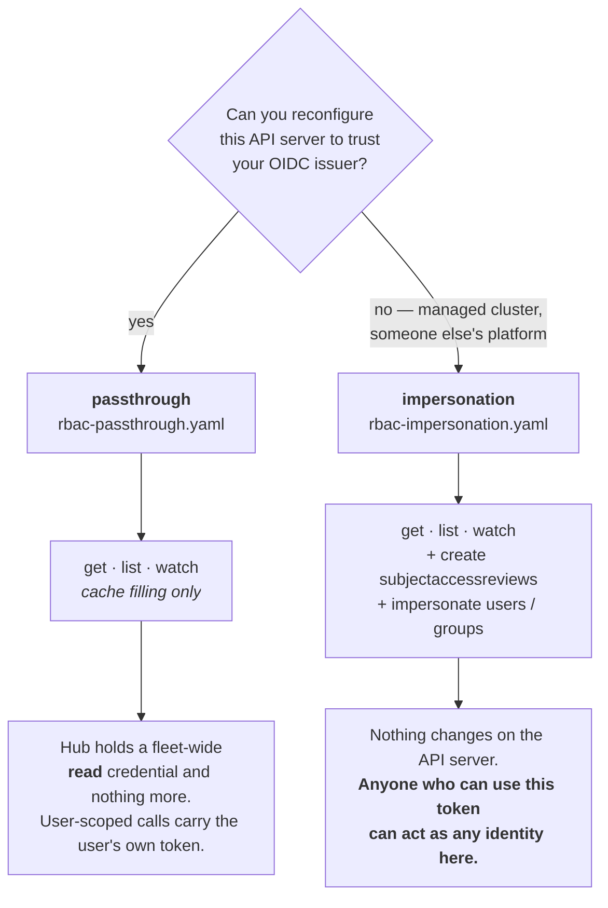

# Registering a remote cluster

The Helm chart grants Orrery what it needs in the cluster it runs in. Every
*other* cluster in the fleet needs a credential of its own, and that is what
these files are: the same grants, as plain manifests you apply to each remote
cluster, in two variants matching the two auth modes.

| File | For clusters registered with | Grants |
| --- | --- | --- |
| [`rbac-passthrough.yaml`](rbac-passthrough.yaml) | `authMode: passthrough` | cluster-wide read only |
| [`rbac-impersonation.yaml`](rbac-impersonation.yaml) | `authMode: impersonation` | cluster-wide read, SubjectAccessReview, impersonate |
| [`preflight.sh`](preflight.sh) | either | verifies one cluster before you register it |

Both manifests grant cluster-wide read with a wildcard. To narrow that — to
keep certificates, secrets or a whole API group out of the dashboard's caches —
see [docs/RBAC.md](../../docs/RBAC.md), which also carries the minimum grant for
a read-only install.

## Which variant

Both modes need a read credential here — informer caches and discovery are
always filled with the dashboard's own identity, whichever mode a cluster
uses. The difference is what else the hub is trusted to do.



Passthrough's cost is the configuration it demands of this API server:

```
--oidc-issuer-url=https://accounts.example.com
--oidc-client-id=orrery
--oidc-username-claim=email
--oidc-username-prefix=oidc:
--oidc-groups-claim=groups
--oidc-groups-prefix=oidc:
```

Those four mapping flags must match the hub's `usernameClaim` /
`usernamePrefix` / `groupsClaim` / `groupsPrefix` exactly: in passthrough the
API server does its own claim mapping, and *that* is the identity RBAC
evaluates. Passthrough also needs `oidc.offlineAccess: true` on the hub, or
users' tokens expire mid-session while their dashboard session is still alive.

Mixing modes across the fleet is fine — it is a per-cluster setting, so
clusters you control can be passthrough while a managed cluster you cannot
reconfigure stays on impersonation.

## Applying it

```bash
kubectl --context prod-eu apply -f rbac-passthrough.yaml
./preflight.sh --context prod-eu --mode passthrough
```

`preflight.sh` checks the grants the mode actually needs, warns when a
passthrough cluster is carrying impersonation's privileges anyway, and — given
a real ID token — confirms the API server accepts it and prints the username
and groups it derives:

```bash
./preflight.sh --context prod-eu --mode passthrough \
  --token-file /tmp/id_token --username-prefix 'oidc:'
```

Run that one. A cluster whose audience or prefixes disagree with the hub still
probes **healthy** in the fleet view, because health is measured with the hub's
own credential — the mismatch surfaces only as every user seeing permission
denied on that cluster and nowhere else. The check turns a confusing support
ticket into a line of output.

## Building the hub's kubeconfig

The hub reads one kubeconfig with one context per cluster. To append a cluster
to it (repeat per cluster, then create the secret once):

```bash
CTX=prod-eu                       # name the hub will show for this cluster
REMOTE=prod-eu                    # your local kubectl context for it
KUBECONFIG_OUT=./fleet.yaml

SERVER=$(kubectl --context "$REMOTE" config view --minify --raw \
  -o jsonpath='{.clusters[0].cluster.server}')
CA=$(kubectl --context "$REMOTE" config view --minify --raw --flatten \
  -o jsonpath='{.clusters[0].cluster.certificate-authority-data}')
TOKEN=$(kubectl --context "$REMOTE" get secret orrery-remote-token -n orrery \
  -o jsonpath='{.data.token}' | base64 -d)

KUBECONFIG=$KUBECONFIG_OUT kubectl config set-cluster "$CTX" --server="$SERVER"
KUBECONFIG=$KUBECONFIG_OUT kubectl config set "clusters.${CTX}.certificate-authority-data" "$CA"
KUBECONFIG=$KUBECONFIG_OUT kubectl config set-credentials "$CTX" --token="$TOKEN"
KUBECONFIG=$KUBECONFIG_OUT kubectl config set-context "$CTX" --cluster="$CTX" --user="$CTX"
```

Then mount it and register the clusters:

```bash
kubectl create secret generic orrery-kubeconfigs --from-file=fleet.yaml=./fleet.yaml
```

```yaml
kubeconfigSecret: orrery-kubeconfigs
clusters:
  - name: hub
    inCluster: true
    authMode: passthrough
  - name: fleet
    kubeconfig: /etc/orrery/kubeconfigs/fleet.yaml
    context: '*'          # expands to one entry per context in the file
    authMode: passthrough
```

`context: '*'` takes each cluster's name and display name from its context
name and gives them all the same labels. List clusters individually instead
when you want per-cluster `region` / `env` labels for grouping in the fleet
view, or when they do not all share one auth mode.

## Rotating the token

The token Secret in these manifests does not expire, which is deliberate — a
hub that must be redeployed to keep working will be down at the wrong moment —
but it means rotation is your job:

```bash
kubectl --context prod-eu delete secret orrery-remote-token -n orrery
kubectl --context prod-eu apply -f rbac-passthrough.yaml   # mints a fresh one
```

Then rebuild the kubeconfig and update the secret. The hub picks up the new
credential when its pods restart; a cluster whose token was revoked shows as
unreachable rather than taking the dashboard down.
