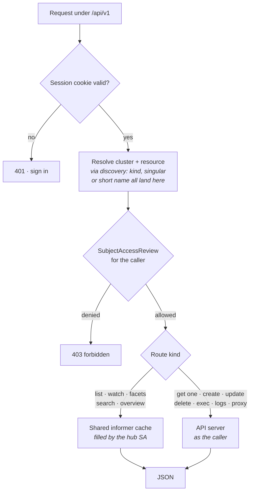

# API

Everything is served under `/api/v1`. The resource surface is one shape:
`{group}` is `core` for the legacy group and `{namespace}` is `_` for
cluster-scoped resources, so a single route serves every group/version/resource
the cluster advertises — built-in kinds and custom resources alike.

Every read and every write is preceded by a `SubjectAccessReview` against the
cluster in question. Which identity makes the onward call, and whether the
answer comes from a cache or the API server, differs by route:



See [How permission works](../README.md#how-permission-works) in the README,
[RBAC.md](RBAC.md) for the grants each branch needs, and
[ARCHITECTURE.md](ARCHITECTURE.md) for the caching design behind it.

## The surface

```
GET    /api/v1/healthz
GET    /api/v1/auth/config                       what the login page should offer
GET    /api/v1/auth/login                        starts the OIDC flow
GET    /api/v1/auth/callback                     completes it
POST   /api/v1/auth/logout
GET    /api/v1/me                                the caller as the dashboard resolved them
GET    /api/v1/capabilities                      the read-only surface, machine-readable
GET    /api/v1/clusters
GET    /api/v1/search                            find objects by name across clusters

GET    /api/v1/clusters/{c}/discovery
GET    /api/v1/clusters/{c}/overview
GET    /api/v1/clusters/{c}/stats
GET    /api/v1/clusters/{c}/events
GET    /api/v1/clusters/{c}/metrics/nodes
GET    /api/v1/clusters/{c}/metrics/pods
GET    /api/v1/clusters/{c}/explain
GET    /api/v1/clusters/{c}/rollout/history
GET    /api/v1/clusters/{c}/pods/{namespace}/{name}/logs
GET    /api/v1/clusters/{c}/pods/{namespace}/{name}/env
GET    /api/v1/clusters/{c}/logs                 several pods at once, no socket
GET    /api/v1/clusters/{c}/access               may I? — one resource, several verbs
GET    /api/v1/clusters/{c}/access/namespaces    where may I?

GET    /api/v1/clusters/{c}/resources/{group}/{version}/{resource}
GET    /api/v1/clusters/{c}/resources/{group}/{version}/{resource}/facets
GET    /api/v1/clusters/{c}/resources/{group}/{version}/{resource}/{namespace}/{name}
GET    /api/v1/clusters/{c}/resources/{group}/{version}/{resource}/{namespace}/{name}/related
POST   /api/v1/clusters/{c}/resources/{group}/{version}/{resource}
PUT    /api/v1/clusters/{c}/resources/{group}/{version}/{resource}/{namespace}/{name}
PATCH  /api/v1/clusters/{c}/resources/{group}/{version}/{resource}/{namespace}/{name}
DELETE /api/v1/clusters/{c}/resources/{group}/{version}/{resource}/{namespace}/{name}

POST   /api/v1/clusters/{c}/access               (batch; the GET above is the read-only form)
POST   /api/v1/clusters/{c}/actions/{action}
GET    /api/v1/clusters/{c}/proxy/{namespace}/{pods|services}/{name}/*   (optional)

GET    /api/v1/clusters/{c}/ws/watch/{group}/{version}/{resource}
GET    /api/v1/clusters/{c}/ws/logs
GET    /api/v1/clusters/{c}/ws/exec
```

`{action}` is one of `scale`, `restart`, `rollout-undo`, `trigger-cronjob`,
`suspend-cronjob`, `cordon`, `drain`, `evict`, `debug`. Each takes a JSON body
naming its target and is authorized as the verb and subresource the equivalent
`kubectl` command would need — scaling goes through the `scale` subresource,
drain through the eviction API, `debug` through `patch` on
`pods/ephemeralcontainers`.

`drain` checks eviction permission per pod and reports what it could not evict
as counts rather than names — the names are what the caller may not see.
`notPermitted` counts denials. `notChecked` counts pods whose review the API
server could not perform, which a drain is a likely moment for; those pods were
not evicted either, so the node is not fully drained, but the reason is not
permission and saying it was sends an operator to ask for access they have.

`debug` is one-way: Kubernetes has no API for removing an ephemeral container,
so it lives until the pod is replaced. Each attempt gets a generated name,
since a second one would otherwise collide with the first, and the response
carries that name to exec into once it starts. The image comes from
`debug.image`, never from the request.

Everything from `/me` down requires a session. `healthz` and `auth/config` do
not, so a probe needs no credential and the login page can render before anyone
has signed in. `auth/login` and `auth/callback` exist only when OIDC is
enabled; with it off, every request runs as a fixed anonymous identity and
there is nothing to sign in to.

## Listing

List endpoints take `namespace`, `q`, `labelSelector`, `fieldSelector`,
`sort`, `order`, `page`, `pageSize` and `view=table|full`.

`q` is free text matched against name, namespace and labels (`app=web` works).
Unsupported `fieldSelector` fields are rejected with a 400 naming the
supported set, rather than silently matching nothing.

`where` is repeatable and takes the column predicates described under Events.
It is bounded in two directions, because they are separate quantities: at most
16 predicates per request, and at most 256 bytes in any one `=~` / `!~` pattern
with 512 across all of them. Both run against every object in scope before the
page is cut, and the cost of matching is proportional to the length of the
pattern as well as the length of the list — so a count on its own would leave
one predicate free to carry the whole request line.

The page arrives under `items` for `view=table` and under `objects` for
`view=full`, and **the requested one is always present** — an empty namespace, a
page past the end and a filter that matches nothing all return `[]` rather than
omitting the key. The view that was *not* requested is absent, so "empty
because you asked and there is nothing" stays distinguishable from "not the
view you asked for", and no client needs to guard the field before reading it.

Responses ship projected rows rather than whole objects. Well-known kinds get
hand-tuned tables; custom resources get their own `additionalPrinterColumns` —
the same columns `kubectl get` would show. `view=full` returns the objects
themselves when a caller genuinely needs them.

A user without cluster-wide list permission gets the namespaces they *can*
read, with an explicit scope in the response; when that scan hits
`authz.namespaceScanLimit` the response carries a warning the UI surfaces,
because a truncated list and an empty cluster look identical otherwise.

## Reading and writing one object

`GET .../{namespace}/{name}` accepts `format=yaml`, which is what the editor
loads.

Writes accept `dryRun=true`. The write is then sent to the API server with
`DryRun=All`, so admission, mutating webhooks and validation all run and the
result comes back without anything being persisted — this is how the editor
checks an edit against the cluster before offering to apply it. `PATCH` honours
the `Content-Type` (JSON merge, strategic merge, JSON patch); `DELETE` accepts
`propagationPolicy`.

## Watching

The watch endpoint accepts the same `q` / `labelSelector` / `fieldSelector` as
listing, and translates edits across the filter boundary into ADDED/DELETED,
so a filtered page only hears about the objects it shows.

The `INIT` frame carries `warnings` when the snapshot is partial, in the same
sentences the list endpoint uses — a namespace denied, or one whose access
review could not be performed. A stream that narrows in silence is worse than a
list that does: nothing further ever arrives for the missing rows, so the table
stays wrong for as long as the socket is open and reads as a quiet cluster.

A subscriber whose buffer fills is dropped with an `OVERFLOW` message telling
it to reload, rather than being allowed to stall the shared cache for everyone
else. The re-authorization check sends the same message when the caller's
visible namespaces have *changed* since the stream opened, in either direction.
A snapshot plus deltas cannot express that: rows already sent for a namespace
since lost are never retracted, and a namespace regained was excluded from
`INIT`, so the next edit to one of its objects would arrive as `MODIFIED` for a
row the client has never seen.

## Facets

`GET .../resources/{g}/{v}/{r}/facets` returns the distinct label keys and
values, plus low-cardinality field values, on the objects the caller may list.
This is the vocabulary behind the search bar's autocomplete, and the results
are memoised per cluster/resource/scope.

The UI exposes all of it as one search input: bare words are free text,
`key=value` / `key!=value` / `!key` / `key in (a,b)` are label terms, and
dotted keys like `status.phase=Running` are field terms.

## Logs

`GET .../pods/{namespace}/{name}/logs` is a plain-text snapshot;
`download=true` sends it as an attachment.

`GET .../logs?namespace=&pod=` is the same for several pods at once, returned
as JSON rather than text: repeat `pod` for up to 20, and each comes back with
its own lines or its own error. It is the snapshot half of `/ws/logs`, for
callers that ask a question rather than watch a rollout — a socket handshake,
an origin check and an idle connection are a lot of machinery for reading the
last hundred lines of three replicas. One unreadable pod is reported in its own
entry so a terminating replica does not hide its healthy siblings; a pod the
caller may not read at all refuses the whole request, because dropping it
silently would present a partial answer as a complete one.

`GET .../ws/logs` follows. Repeat the `pod` parameter to merge several pods
into one feed — up to 20, each line tagged with the pod it came from. Every pod
is authorized *before* the socket opens, so a caller who may read some of a
workload's pods but not others is refused outright rather than shown a partial
feed they would read as complete. Once the feed is live, one pod failing is
reported as a `STREAM_ERROR` for that pod and the rest keep flowing — a replica
can be terminating while its siblings are healthy.

Both accept `container`, `previous`, `timestamps`, `tailLines`,
`sinceSeconds` and `limitBytes`. `tailLines` is clamped (default 500, max
100000) and there is deliberately no "all lines" mode: unbounded scrollback
belongs to the log store, not a browser tab. The snapshot additionally holds
each pod to 10000 lines *and* 1 MiB, since a single line may be a megabyte on
its own and the reply is held whole in memory at both ends; a pod cut by either
ceiling is flagged `truncated`. Lines are batched for up to 100ms
before being sent, so a pod logging ten thousand lines a second does not become
ten thousand WebSocket frames a second.

## Pod environment

`GET .../pods/{namespace}/{name}/env` resolves each container's environment —
`configMapKeyRef`, `secretKeyRef`, `fieldRef` and `resourceFieldRef` included —
by reading the referenced objects under the **caller's** identity. Each
variable carries where it came from; one that could not be resolved (a
forbidden reference, a missing key) carries the reason instead of being
silently dropped, and values that came out of a Secret are flagged so the
console masks them until asked.

## Explain

`GET .../explain?group=&version=&kind=&field=` answers
`kubectl explain <resource>[.field...]` from the cluster's own OpenAPI v3
document, so the field docs match the API server's version and cover any CRD
that publishes a schema.

## Events

`namespace` is repeatable on the list, watch, facets and event endpoints:
`?namespace=demo&namespace=payments` answers for both at once, authorizing each
on its own, and the response's `scope` names the namespaces it actually covers.
A namespace the caller may not list is dropped with a warning rather than
failing the whole request; being allowed none of them is still a 403.

The warning says which of two things happened, because they are not the same
and only one of them is worth taking to whoever administers your RBAC. "You may
not list pods in team-b" is a denial the API server returned. A namespace whose
access review could not be performed at all gets its own sentence, which says
so and says it is not a permission problem. The event feed carries these in
`warnings` too — it used to narrow in silence, and a feed that has quietly
dropped a namespace reads as everything that happened.

`GET .../events` returns the event feed, filterable by `namespace`, `q`,
`warningsOnly`, and by the object involved (`involvedUID`, `involvedName`,
`involvedKind`) — the last of which is what an object's own event list uses.

`q` is a search box rather than one substring: its words are ANDed and each may
match a different column, `"a phrase"` is one word, and `-word` excludes. At
most 16 words: each is looked for in every searched column of every event in
scope, so the words multiply rather than add. The
same `where` predicates the resource lists take apply here too, bound to the
event columns — `count>3`, `lastSeen<15m`, `reason=~^Failed`, `type!~Normal`.
Both are applied before `limit`, so a match older than the newest few hundred
events still surfaces, and `total` reports what matched rather than what fitted.

## Rollout history

`GET .../rollout/history?namespace=&name=` lists a deployment's revisions,
newest first, from the ReplicaSets it owns.

Each entry carries what `kubectl rollout history` shows — revision, images,
change cause — plus what it cannot: `ready`/`replicas` for that revision, and
`changes`, naming how its pod template differs from the one deployed now.
Images are reported per container in the direction a rollback would travel
(`web: nginx:1.25 → nginx:1.24`); everything else is named rather than diffed
(`env`, `args`, `resources`), because the choice being made needs to know
*whether* to look, and the object's YAML is where to look.

`diff` carries the same answer in full: the template's YAML lines that differ,
with two lines of context, `-` being what is deployed now and `+` what the
revision would restore. Runs of unchanged lines between hunks are replaced by a
single `…` entry, and a diff past 120 lines stops with `diffTruncated` counting
the changed lines left out — a diff that ends mid-change must not read as a
complete one.

Diffs are computed for at most the 25 most recent revisions. The list is every
ReplicaSet the deployment owns — `revisionHistoryLimit`, and so whatever an
operator set it to — and each diff is a longest-common-subsequence table over
two pod templates, which is quadratic: at the input cap one costs about 8.6ms
and 16.3MB. Revisions past the ceiling are still listed and still carry
`changes` and `identical`; only the line detail stops, and `diffOmitted` marks
them so a row with no `diff` is not read as one with nothing to show.

`identical` says the template matches the deployed one exactly, so rolling back
would change nothing. It is not implied by an empty `changes`: a difference this
server does not name leaves both empty and `identical` false. The comparison
ignores `pod-template-hash`, which the Deployment controller derives from the
rest of the template and which therefore differs between any two revisions.

## Neighbourhoods

`GET .../resources/{g}/{v}/{r}/{namespace}/{name}/related` returns everything
attached to one object: the owners above it, the objects it owns below it, the
node or services it is tied to, the ConfigMaps and Secrets its spec names, and
its own events.

It exists because assembling that from the resource routes means knowing
Kubernetes convention the server already knows. A Deployment's pods are two
hops away through ReplicaSets nobody thinks about — list the ReplicaSets, match
owner UIDs, list the pods, match again, then fetch events. This walks it once,
server-side, and every client agrees on what "related" means.

Each entry carries a `relation` — `owner`, `child`, `descendant`, `node`,
`hosts`, `selects`, `selected-by`, `reference` — and a `path` that is the route
serving it, already assembled, so a caller follows a link rather than rebuilding
one out of placeholders. `depth` (default 2, max 4) bounds the ownership walk in
each direction; `childResource` names an extra resource to scan, for custom
controllers whose children are not one of the built-in edges, and is capped at
8 per request for the reason `/search` caps its scan set — a named resource is
listed through the shared cache, which starts an informer for it; `events=false`
drops the bundled events.

`events` distinguishes its three states, which matters most to the callers this
endpoint was built for — an agent reading the response cannot look at a warning
and infer what a person would. Asked for and empty is `"events": []`, with the
columns, so an object nothing has happened to says so. Not asked for is a
missing field. A scan that could not run is a missing field *and* a warning
naming it.

Nothing here bypasses a check. Every scan runs the same access review a list
would, and a scan the caller may not run becomes a `warning` rather than a
silent gap — "this Deployment has no pods" and "I could not look" are different
answers. A link the caller may not follow comes back as a named reference with
a `note`: the name was already visible in the object they just read, but its
contents are not.

## Search

`GET /api/v1/search?q=` finds objects by name across every cluster at once,
which is the question an alert or a ticket actually poses. `cluster` and
`namespace` narrow it, `resource` replaces the default scan set, and `limit`
caps the answer.

The default set is deliberately not "everything discovery advertises": listing
every resource would start an informer for every resource, and informer caches
are shared and long-lived, so a broad search would permanently enlarge the
dashboard's footprint to answer one question. The defaults are the kinds people
go looking for by name, all of which the cluster overview already caches.

Hits are scored — an exact name match above a prefix above a label-only match —
and the score is reported, so a caller can tell a real hit from a coincidence
instead of trusting the order. `scanned` says what was looked at and `warnings`
name the clusters and resources that could not be, so "no results" is never
confused with "nowhere to look".

A `cluster` value that names nothing configured is one of those warnings rather
than a refusal or a silence. Narrowing to a cluster that does not exist selects
no cluster, so the reply is an empty result — and an empty result reads as "your
object is not there", which is a claim about a cluster nobody asked about. The
warning names the value and lists the clusters that do exist. Naming one that
exists alongside one that does not still searches the first.

## Permission checks

`POST .../access` answers a batch of questions in one round trip; it is what
the console uses to decide which buttons to render, and it carries a CSRF token
because every POST here does.

`GET .../access?resource=&verb=` is the same question for a client that only
reads. Asking changes nothing — a `SubjectAccessReview` is itself a read — so
it needs no token. Name one resource (as a plural, singular, kind or short
name) and any number of verbs; naming none asks about `get`, `list` and
`watch`. A denial is an answer with a 200, not a 403: the caller asked a
question and got "no".

`GET .../access/namespaces?resource=` answers *where*. A client refused a
cluster-wide list otherwise has no way to find the namespaces it can read
short of probing each one, and the scan behind this is the one every list
already performs and caches.

## Metrics

`GET .../metrics/nodes` and `GET .../metrics/pods?namespace=` proxy
metrics-server. A cluster without metrics-server returns
`{available: false}` with a plain explanation, not a 500 that reads as a
dashboard bug.

`warnings` carries what a reading is missing while still being worth serving: a
namespace whose metrics could not be read, or a pod cache that could not supply
the container limits. The second is not cosmetic. Pod usage is drawn as a
fraction of its limits, and a pod with no limit has no denominator, so the
console draws an empty bar — which means "nobody set a limit on this". A limits
lookup that failed silently made that statement about every pod at once.

A refusal is not a `{available: false}`; it stays a 403, because "you may not
read metrics here" is a fact about the caller and not about the cluster.

## HTTP proxy

`GET|HEAD .../proxy/{namespace}/{pods|services}/{name}/*` relays to a pod or
service through the API server's proxy subresource, under the caller's own
identity — the browser's answer to `kubectl port-forward` for HTTP workloads.
`{name}` may carry `:port`. Only GET and HEAD; writes are excluded because the
proxied page renders inside the console's origin.

It is gated on `get` of `pods/proxy` or `services/proxy`, and it is optional:
with `proxy.enabled: false` the route is not registered at all, so it 404s like
any unknown path rather than existing-but-refusing. `GET /api/v1/me` reports
whether it is on under `features.proxy`, which is how the console knows not to
offer the control.

## Capabilities

`GET /api/v1/capabilities` describes the read-only surface in the shape a
program needs to call it: every read route, its query parameters, their types
and defaults. Everything in it is also in this document, which is the right
place for a person and the wrong place for a client — something generating
tools from this API otherwise hard-codes a route table and quietly rots when a
parameter is added.

It describes the server actually answering: a build with `proxy.enabled: false`
does not advertise the proxy, and one without OIDC does not advertise a login.
Writes and `ws/exec` are deliberately absent, so a client handed this document
cannot call them by accident. The table is hand-written and pinned by a test
that walks the router, so a read route added without an entry fails the build
rather than the caller who trusted it.

It is deliberately not OpenAPI. A schema for these responses would be mostly
`unstructured`, since the interesting half of every payload is a Kubernetes
object whose shape comes from the cluster rather than from this server — and
`explain` already serves that half from the cluster's own OpenAPI.

## Sessions

Sessions are cookie-based. The session cookie is `HttpOnly` and AES-GCM
encrypted, carrying only an opaque ID; tokens stay server-side. Mutating
requests carry a double-submit CSRF token in `X-CSRF-Token`, which `GET /me`
returns alongside the session's expiry.

WebSocket handshakes cannot carry custom headers, so the `Origin` check in the
upgrader stands in for CSRF on the three streaming endpoints.

## Errors

Non-2xx responses are `{"error": "<kind>", "code": <status>}`, optionally with
a `reason` and a `details` object carrying structured extras such as the
offending resource. The console can therefore distinguish "you may not do
this" from "this does not exist" from "the cluster is unreachable" without
parsing prose.

## Observability

`/metrics` on the **metrics listener** (`server.metricsAddr`, not the app port)
exposes request rate and latency by route — labelled by pattern, so cardinality
stays bounded — plus live gauges for cache size and subscriber counts per
cluster and resource.

`GET /api/v1/clusters/{c}/stats` shows exactly which caches are running, how
many objects each holds, and how long they have been idle. It is the first
place to look when memory use surprises you.

The list is filtered by an access review, because the set of running caches is
itself information about the cluster. A cache the caller may not list is simply
absent; a cache whose review could not be *performed* is counted in `unchecked`
and explained in `warning`, because `informers` and `totalObjects` are read as
measurements and this is the page you open when you doubt the figure. A total
quietly missing a cache is worse than no total.
