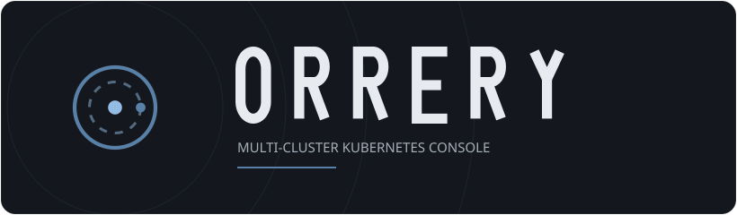

# Brand

  

The mark is an orrery — concentric orbits with a body riding the inner ring —
drawn monoline so it holds together from a favicon to a banner. It is defined
once for the console in
[`web/src/components/Logo.tsx`](../web/src/components/Logo.tsx) and mirrored as
static assets for everything outside it.

## Assets

| Asset | Use |
| --- | --- |
| [`assets/orrery-mark.svg`](assets/orrery-mark.svg) | The mark alone — favicon, Helm chart icon, avatars |
| [`assets/orrery-banner.svg`](assets/orrery-banner.svg) | Mark, wordmark and tagline on the console's own ground |

Both are plain geometry with no external references, so they render the same
whether they are opened as a document or served as an ``.

## Palette

The console's own tokens, defined as custom properties in
[`web/src/index.css`](../web/src/index.css):

| Token | Value | Role |
| --- | --- | --- |
| `--color-canvas` | `#14181e` | Page ground |
| `--color-surface` | `#1a2028` | Sidebar, headers, cards |
| `--color-accent` | `#5980a6` | Fills, bars, active rules |
| `--color-accent-text` | `#94bce3` | Links and active text |
| `--color-ink` | `#e7eaee` | Primary text |
| `--color-ink-muted` | `#a7afba` | Secondary text |

Status colours follow the same ramp: `--color-ok` `#63bd8c`, `--color-warn`
`#d9a94e`, `--color-danger` `#e0705c`, `--color-idle` `#8b95a3`.

## Type

Display type is Barlow Condensed, body text Barlow, code in the system mono
stack.

The banner's wordmark is drawn as geometry rather than set in Barlow
Condensed. A logo has to render identically for everyone, and the webfont is
not installed on the machines that read a README — set as live text it falls
back to whatever grotesque is available, which is neither condensed nor
contained. The letterforms are monoline condensed caps (cap height 100,
stroke 13, letter box 46, pitch 76) chosen to pair with the monoline orbits of
the mark.
