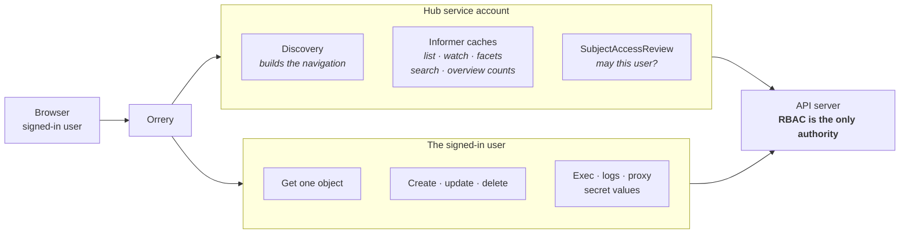
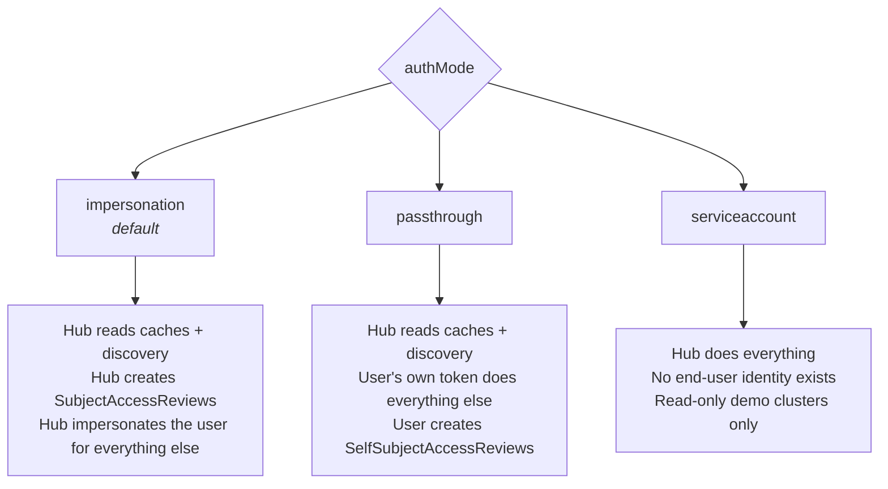
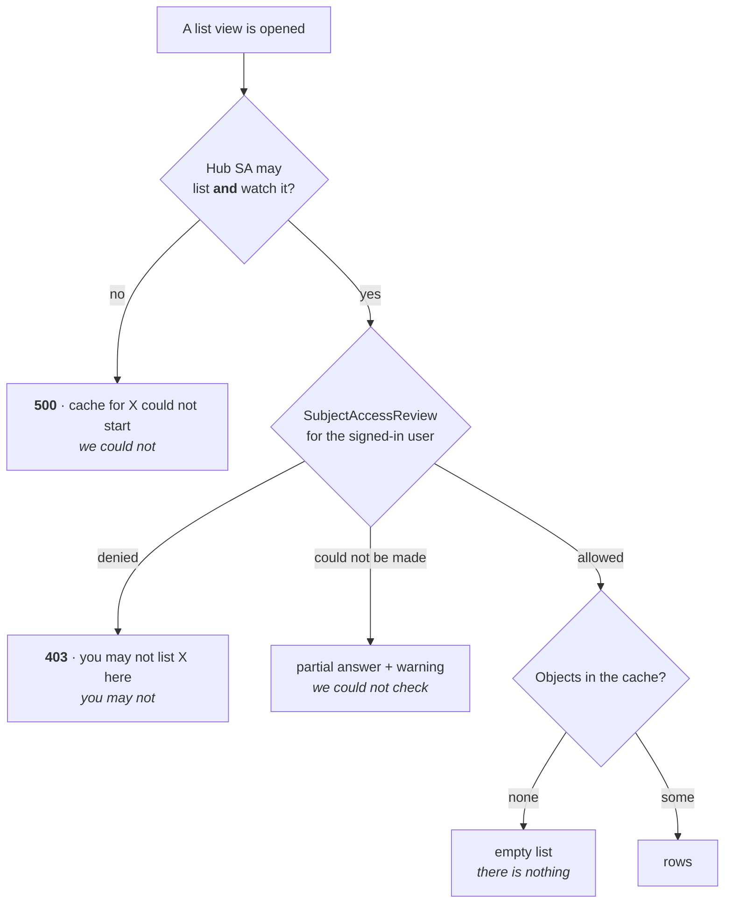
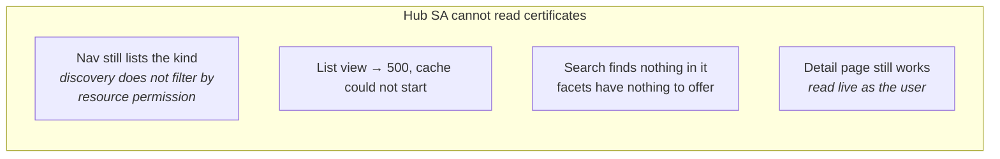

# Service account permissions

Orrery holds one credential per cluster — the **hub service account** — and it
is not the credential your reads are authorized against. Keeping those two
apart is most of what this document is for. The rest is the practical part:
which grants switch a surface such as certificates on or off, and the smallest
grant that still produces a working read-only console.

The [Helm chart's rbac.yaml](../deploy/helm/orrery/templates/rbac.yaml) covers
the cluster Orrery runs in; [deploy/remote-cluster](../deploy/remote-cluster/)
covers every other cluster in the fleet. Both are the same shape.

## Two credentials, two jobs



The hub account **fills** the caches. The user's identity **unlocks** them, and
is what every single-object read, write, exec and log stream is actually made
with — impersonated, or their own bearer token in `passthrough` mode. See
[ARCHITECTURE.md](ARCHITECTURE.md#read-path) for why the caches exist at all.

Two consequences follow, and they are the reason this page exists:

- **The hub's grants decide which surfaces exist.** A resource the hub cannot
  list and watch has no cache, so no list view, no facets, no search hits and
  no overview count — for everyone, cluster-admins included.
- **The user's grants decide what is in them.** Narrowing the hub is a
  *surface* toggle, not a security boundary. The boundary is the access review,
  and it is made against the end user every time.

Which credential is which depends on the cluster's `authMode`:



## What a missing permission looks like

This codebase treats *"you may not"*, *"we could not"* and *"there is nothing"*
as three different answers, because confusing them sends people to change
bindings that were never the problem.



| Symptom | Cause | Fix |
| --- | --- | --- |
| One kind errors, everything else works | Hub SA lacks `list`+`watch` on that resource | Widen the hub's ClusterRole |
| Every kind errors on one cluster | Hub credential is wrong, expired, or bound to nothing there | `deploy/remote-cluster/preflight.sh` |
| Rows for some namespaces only, with a warning | The *user* is bound narrowly | Nothing is broken |
| Overview counts say "not permitted" | The *user* lacks the read | Bind the user, not the hub |
| Overview counts say "temporarily unavailable" | The *hub* lacks the read, or the cache never synced | Widen the hub's ClusterRole |

`list` and `watch` are both required, and granting one without the other is a
common way to arrive here by accident. Client-go asks for a streaming list
first and falls back to plain LIST + WATCH when that is refused, so a missing
`watch` is not rescued by the fallback — the fallback needs `watch` too.

**Narrowing the hub does not evict what is already cached.** An informer that
has synced keeps serving through watch errors, because a dropped watch is
normally transient and the reflector's job to retry. Take a grant away and that
cache goes on answering from stale data until it is retired for idleness or the
pod restarts. Roll the deployment if you need the change to take effect now.

## Certificate surfaces

There is no certificate feature flag in `orrery.yaml` and no `certificates:
enabled` in `values.yaml`. Certificates reach the console the way every other
kind does — through discovery and the generic resource routes — so the switch
that turns them on and off is the hub service account's ClusterRole.

"Certificate features" is three separate resource families, and you almost
certainly care about them differently:

| Surface | Group / resources | Sensitivity |
| --- | --- | --- |
| Kubernetes CSRs | `certificates.k8s.io` → `certificatesigningrequests` | Public certificate requests; the signed cert is in `status`, never the key |
| cert-manager | `cert-manager.io` → `certificates`, `certificaterequests`, `issuers`, `clusterissuers`; `acme.cert-manager.io` → `orders`, `challenges` | Objects reference keys held in Secrets; they do not contain them |
| TLS material | `""` → `secrets` of type `kubernetes.io/tls` | **The private key itself** |

The third is the one that matters, and it is already handled specially: secret
payloads are stripped by the informer's transform *before* anything enters the
cache, so the hub's broad read never puts a private key in the dashboard's
heap. Opening a secret refetches it live under the viewer's own identity. The
hub's reach over TLS secrets ends at their names, types and value sizes.

### Turning certificates off

RBAC has no deny rule, so you disable by narrowing what is granted. The stock
chart grants `apiGroups: ['*'], resources: ['*']` for `get, list, watch`;
replace that one rule with an explicit list that omits the certificate groups:

```yaml
# ClusterRole rules — the cache-filling grant, narrowed.
rules:
  - apiGroups: ['apiextensions.k8s.io']
    resources: ['customresourcedefinitions']
    verbs: ['get', 'list', 'watch']

  # Everything the console should be able to browse. Note what is NOT here:
  # certificates.k8s.io, cert-manager.io and acme.cert-manager.io.
  - apiGroups: ['']
    resources:
      ['namespaces', 'nodes', 'pods', 'services', 'events', 'configmaps',
       'persistentvolumeclaims', 'serviceaccounts', 'endpoints']
    verbs: ['get', 'list', 'watch']
  - apiGroups: ['apps']
    resources: ['deployments', 'statefulsets', 'daemonsets', 'replicasets']
    verbs: ['get', 'list', 'watch']
  - apiGroups: ['batch']
    resources: ['jobs', 'cronjobs']
    verbs: ['get', 'list', 'watch']
  - apiGroups: ['networking.k8s.io']
    resources: ['ingresses', 'networkpolicies']
    verbs: ['get', 'list', 'watch']

  # Keep whichever of these the cluster's authMode needs — see below.
  - apiGroups: ['authorization.k8s.io']
    resources: ['subjectaccessreviews']
    verbs: ['create']
```

`secrets` is deliberately absent from that list too, which is the stronger
version of the same move: no Secrets list view, and so no TLS secret *names* in
the dashboard's cache either. Add it back if you want that view — what you are
granting the hub is names, types and value sizes, never payloads. Either way
the detail page still works for anyone the cluster already permits, because it
reads live as the viewer.

Be clear-eyed about what narrowing does and does not do:



Discovery is served from non-resource URLs that every authenticated client may
read, so the sidebar entry does not disappear — it stops working. If you want
certificates genuinely unreachable, take the grant away from your **users**;
narrowing the hub is for reducing what the dashboard caches and what a
compromised pod could read, not for hiding a kind from a determined operator.

### Turning certificates on

On a stock install they are already on: the wildcard covers them. On a narrowed
install, add them back:

```yaml
  - apiGroups: ['certificates.k8s.io']
    resources: ['certificatesigningrequests']
    verbs: ['get', 'list', 'watch']
  - apiGroups: ['cert-manager.io']
    resources:
      ['certificates', 'certificaterequests', 'issuers', 'clusterissuers']
    verbs: ['get', 'list', 'watch']
  - apiGroups: ['acme.cert-manager.io']
    resources: ['orders', 'challenges']
    verbs: ['get', 'list', 'watch']
```

cert-manager's kinds appear under **Custom resources** in the sidebar, which is
sorted by API group: anything outside the legacy groups and `*.k8s.io` is
treated as somebody's CRD. That grouping comes from the discovery document, so
it needs no grant. What the `apiextensions.k8s.io` rule buys is each CRD's
`additionalPrinterColumns` — without it a Certificate list renders with default
columns instead of the Ready / Secret / Age columns cert-manager declares.
`certificates.k8s.io` is a built-in group and sits with the rest.

Approving a CSR is a write on the `certificatesigningrequests/approval`
subresource, made as the signed-in user. It needs nothing here; it needs a
binding on the human. The same is true of deleting a cert-manager Certificate
to force reissue.

## The minimum for a read-only console

The smallest grant that still produces a console someone can use. This is the
`serviceaccount` auth mode — one shared identity, no per-user RBAC, nothing
writable — which is what the mode is for: demos, kiosks, and dashboards on
clusters with no identity provider in front of them.

```yaml
apiVersion: v1
kind: ServiceAccount
metadata:
  name: orrery-readonly
  namespace: orrery
---
apiVersion: rbac.authorization.k8s.io/v1
kind: ClusterRole
metadata:
  name: orrery-readonly
rules:
  # 1. Read CRDs, for the printer columns a custom resource declares. The
  #    sidebar itself comes from discovery and needs no grant; this is what
  #    stops every CRD list from rendering with default columns.
  - apiGroups: ['apiextensions.k8s.io']
    resources: ['customresourcedefinitions']
    verbs: ['get', 'list', 'watch']

  # 2. Fill the caches. Exactly what the console's own pages read: the
  #    overview counts nodes, namespaces, pods and these seven workload kinds,
  #    and the events feed backs the warnings panel.
  - apiGroups: ['']
    resources: ['namespaces', 'nodes', 'pods', 'services', 'events']
    verbs: ['get', 'list', 'watch']
  - apiGroups: ['apps']
    resources: ['deployments', 'statefulsets', 'daemonsets']
    verbs: ['get', 'list', 'watch']
  - apiGroups: ['batch']
    resources: ['jobs', 'cronjobs']
    verbs: ['get', 'list', 'watch']
  - apiGroups: ['networking.k8s.io']
    resources: ['ingresses']
    verbs: ['get', 'list', 'watch']

  # 3. Answer "may I?" about itself. Usually already granted to every
  #    authenticated identity by system:basic-user; explicit so a cluster that
  #    removes that binding does not turn every page into a 403.
  - apiGroups: ['authorization.k8s.io']
    resources: ['selfsubjectaccessreviews']
    verbs: ['create']

  # 4. Discovery, health probing and `explain`. Normally covered by
  #    system:discovery; explicit for the same reason as above.
  - nonResourceURLs: ['/api', '/api/*', '/apis', '/apis/*', '/version', '/openapi/*']
    verbs: ['get']
---
apiVersion: rbac.authorization.k8s.io/v1
kind: ClusterRoleBinding
metadata:
  name: orrery-readonly
roleRef:
  apiGroup: rbac.authorization.k8s.io
  kind: ClusterRole
  name: orrery-readonly
subjects:
  - kind: ServiceAccount
    name: orrery-readonly
    namespace: orrery
```

```yaml
# The matching cluster entry. serviceaccount mode needs no OIDC.
clusters:
  - name: demo
    inCluster: true
    authMode: serviceaccount
```

What you give up, in one list: no writes, no exec, no drain, no log follow
beyond what this account may read, no per-user RBAC, no name in the audit log
but this one, and no secrets — `secrets` is deliberately absent, so the Secrets
list is unavailable rather than shared with every visitor.

Everything above is `get, list, watch` and `create` on a review that changes
nothing. There is no `impersonate` and no `subjectaccessreviews`, which is what
makes this token materially weaker than the two in `deploy/remote-cluster/`.

**Wanted per-user RBAC instead?** Then this is not the minimum you want: keep
`authMode: impersonation`, and add `subjectaccessreviews` plus the
`impersonate` grants. That is the stock chart, and its cost is stated plainly —
anyone who can use that token can act as anyone on the cluster.

## Verifying a grant

Ask the API server rather than reading the YAML back:

```bash
SA=system:serviceaccount:orrery:orrery

# Can the hub fill a cache for this kind? Both must say yes.
kubectl auth can-i list  certificatesigningrequests.certificates.k8s.io --as="$SA"
kubectl auth can-i watch certificatesigningrequests.certificates.k8s.io --as="$SA"

# Should say no on a read-only install.
kubectl auth can-i create subjectaccessreviews.authorization.k8s.io --as="$SA"
kubectl auth can-i impersonate users --as="$SA"

# What the console itself sees, per cluster and per resource.
curl -s "$ORRERY/api/v1/clusters/demo/access?resource=certificatesigningrequests"
```

`GET /api/v1/clusters/{c}/access` answers the same question for the *signed-in
user* rather than the hub, which is the one to reach for when someone reports
an empty page — see [API.md](API.md#permission-checks). For a whole cluster at
once, `deploy/remote-cluster/preflight.sh --context <ctx> --mode <mode>` checks
the grants the mode actually needs and warns when a passthrough cluster is
carrying impersonation's privileges anyway.

## Rotation and blast radius

The hub credential is long-lived and does not expire on its own. Under
impersonation it can act as any identity on the cluster; under passthrough it
is a fleet-wide read credential and nothing more. Either way:

- Restrict `exec` into the Orrery namespace, and `get` on its secrets, as
  tightly as you restrict `cluster-admin`.
- Rotate the remote-cluster tokens on the same schedule as any other
  service-account token — see
  [deploy/remote-cluster/README.md](../deploy/remote-cluster/README.md#rotating-the-token).
- Prefer `passthrough` for clusters you can reconfigure. It is the only mode
  where the hub holds no power to act as anyone.
